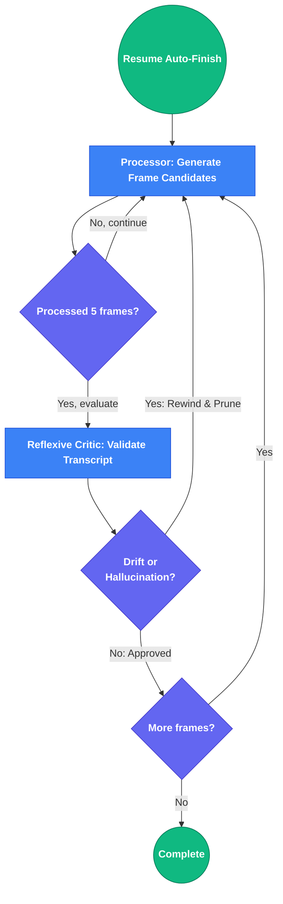

# 🎙️ unmuted

**Unmuted** is a local-first web application designed to turn your screen recording captures into polished, technical how-to videos fit for public consumption. It uses AI Vision-Language Models (VLMs) like OpenAI's GPT-4o, Anthropic Claude, or local Ollama instances to generate timestamped narration transcripts and text overlays by analyzing the visual UI and text in your recordings.

## ✨ Features

- **Automated Frame Extraction**: Uses `ffmpeg` to sample keyframes from your technical screen captures.
- **Tool & Technology Identification**: Automatically detects tools in use (Claude Code, Docker, Python, etc.) and enriches planning with web-researched context.
- **Strategic Planning with Synopsises**: Generates a high-level story plan and 3 narrative synopsises to guide frame-by-frame analysis.
- **Environment-Aware VLM Analysis**: Vision model understands which tools are active in each frame, correctly distinguishing user input in editors vs terminal commands.
- **High-Fidelity Text Recognition**: Uses high-detail image analysis for accurate OCR of code, commands, and UI text.
- **Agentic Auto-Finish**: Powered by a robust **LangGraph StateGraph**, the backend utilizes a Reflexive Critic agent to detect narrative drift and recursively correct mistakes during long sequences.
- **AI-Powered VLM Analysis**: Analyzes your action goals, story plan, and frame sequences to output polished transcripts and overlay suggestions.
- **Interactive Planning UI**: Review and edit the AI-generated story plan—delete unwanted tasks, add your own, before proceeding to frame analysis.
- **Stunning Review UI**: A modern Glassmorphism dashboard built with React allowing you to review and tweak transcripts in a Human-in-the-Loop workflow.

## 🧠 System Architecture & Workflow

Unmuted's workflow is split into two distinct phases:

### Phase 1: Planning (Linear Agents - Direct LLM Calls)

Before frame-by-frame processing, the system performs rapid planning using three sequential agents:

1. **The Tool Identifier**: Analyzes sample keyframes to detect all tools/technologies in use (Claude Code, Docker, Python, etc.) and researches unfamiliar ones via web search. This enriches the planning context.

2. **The Strategic Planner**: Performs a holistic scan of the entire video timeline to construct a one-sentence-per-phase "Story Plan." Uses tool context to understand what's happening in each phase. Users can review, edit, and delete plan tasks before proceeding.

3. **The Synopsis Generator**: Creates 3 distinct narrative synopsises (one sentence each, no fluff, no "in this video..." phrasing). Each emphasizes a different perspective (technical outcome, tools used, problem solved). User selects the best one to guide frame analysis.

### Phase 2: Auto-Finish (LangGraph State Machine with Reflexive Critic)

Once the user begins frame-by-frame review, the interactive processor operates frame-by-frame. When the user clicks **Resume Auto-Finish**, a LangGraph-orchestrated state machine takes over:

1. **The Processor (Drafting Agent)**: The primary LangGraph node. For each frame, it:
   - Receives the Story Plan phases (understanding current progression)
   - References the selected synopsis (narrative guidance)
   - Uses tool context to understand which application is active
   - Infers the current phase based on visual content
   - Generates 3 distinct candidate narrations using a 3-frame sliding window (Previous, Current, Next)
   - Understands that text in editors = user input, not system messages

2. **The Reflexive Critic**: A secondary evaluating node that runs every 5 processing cycles (~50 seconds of video):
   - Inspects the Processor's recent transcript backlog
   - Evaluates against the Story Plan for narrative drift or hallucination
   - If issues detected: rewinds state indices, prunes bad steps, forces re-evaluation
   - If approved: continues processing
   - Enforces one transcript per 10 seconds of video

#### Auto-Finish LangGraph State Machine



## 🛠️ Requirements

- `ffmpeg` (must be installed on your system and available in your PATH)
- Node.js (v18+) and `npm`
- Python 3.10+
- `uv` (Fast Python package/project manager)

## 🔐 Authentication

Unmuted uses static token-based authentication controlled by the `AUTH_TOKENS` environment variable.

**For Local Development:**
Leave `AUTH_TOKENS` empty (or unset) to disable authentication — the UI will not require a login token.

**For Deployed Instances:**
Set one or more comma-separated tokens:
```bash
AUTH_TOKENS=my-secret-token-1,my-secret-token-2
```

When you open the UI, you will be prompted for a token on first load. Enter any token from your `AUTH_TOKENS` list. The token is stored in browser localStorage and reused for subsequent requests.

## 🚀 Getting Started

The application is split into a Python FastAPI Backend and a React/Vite Frontend. You must run both concurrently.

### 1. Set up the Backend (API)

Open a terminal and navigate to the project directory:

```bash
cd backend

# Option A: Use OpenAI API
export VLM_PROVIDER="openai"
export VLM_MODEL="gpt-4o"
export OPENAI_API_KEY="sk-your-openai-key"

# Option B: Use external Ollama Server (e.g. gemma3)
export VLM_PROVIDER="ollama"
export VLM_MODEL="gemma3"
export OLLAMA_BASE_URL="http://192.168.88.86:11434/v1"
export OLLAMA_API_KEY="any-key" # Ollama accepts any string

# If no API key or provider is set, the engine will return "mock" data for UI testing!

### Enabling Verbose Debugging
If you feel the AI analysis is failing or just want to see the exact LLM payload and raw response for every single frame, export the debug flag *alongside* your API keys:
```bash
export DEBUG_VLM="true"
# Then start the server
uv run uvicorn main:app --reload
```
*The raw JSON from the model will print directly to your backend terminal.*

### 2. Set up the Frontend (UI)

Open a second terminal window:

```bash
cd frontend
# Install dependencies
npm install

# Start the Vite development server
npm run dev
```
*The UI will start on `http://localhost:5173`.*

### 3. Run with Docker (Recommended)

If you have Docker and Docker Compose installed, you can start the entire stack with a single command:

```bash
# Copy the example env file and add your API key
cp .env.example .env
# Edit .env with your VLM provider and API key, then:
docker-compose up --build
```

- The app will be available at `http://localhost:5173`.
- Your project workspaces will be persisted in `./backend/workspaces`.

### 4. Deploy to a Cloud Provider (e.g. Railway, Render, Fly.io)

The Docker Compose setup deploys anywhere that supports multi-container apps.

**Railway:**
1. Push your repo to GitHub.
2. Create a new Railway project → **Deploy from GitHub repo**.
3. Railway auto-detects `docker-compose.yml`. Set your env vars (`VLM_PROVIDER`, `VLM_MODEL`, `OPENAI_API_KEY`) in the Railway dashboard.
4. Expose the `frontend` service on a public port — Railway will give you a URL.

**Generic VPS (Ubuntu/Debian):**
```bash
# Install Docker
curl -fsSL https://get.docker.com | sh
# Clone the repo and deploy
git clone <your-repo-url> && cd unmuted
cp .env.example .env && nano .env   # add your API key
docker compose up -d --build
```

> [!NOTE]
> The frontend Nginx container reverse-proxies all `/api/*` requests to the backend, so only **one port (5173)** needs to be publicly exposed.

## 🎬 Usage Instructions

1. **Open the UI**: Navigate to `http://localhost:5173` in your browser.
2. **Setup Project**: Enter the absolute path to a folder containing `.mp4` or `.mkv` videos (e.g., `/home/user/unmuted`).
3. **Draft a Prompt**: Write a short prompt indicating the goal of the video (e.g., "Demonstrate how to deploy a Docker container to Kubernetes").
4. **Scan & Extract Frames**: 
   - Click **Scan Directory** to verify your videos are detected.
   - Click **Extract & Plan**. The backend will:
     - Extract keyframes via `ffmpeg`
     - Identify tools/technologies visible in the video (Claude Code, Docker, Python, etc.)
     - Generate a strategic story plan (one sentence per phase)
     - Generate 3 narrative synopsises to guide analysis
5. **Review & Edit Plan**:
   - Review the AI-generated story plan and synopsises.
   - Delete any unwanted tasks or edit existing ones.
   - Select your preferred synopsis (or the AI will use the first one).
   - Click **Begin Frame-by-Frame Review** to proceed.
6. **Interactive Review**: 
   - Step through the video frame-by-frame as the AI generates 3 distinct narration candidates.
   - The AI uses the story plan phase context, synopsis, tool information, and a sliding 3-frame window to understand what you're doing.
   - Select the best candidate (or write your own) and click **Commit & Next**.
   - At any time, click **Resume Auto-Finish** to complete the remaining frames using the AI's top choices.
7. **Synchronized Playback**: After completion, press play on the side-by-side video viewer to test your flow. The interactive timeline automatically highlights and syncs narration in real time.
8. **Export**: Click **Generate Export Artifacts**. Download your final transcript as `transcript.json`, `transcript.vtt` (WebVTT subtitle format), and YouTube Chapters list.

## 📋 Export Formats

Unmuted provides three export formats for your final transcript:

**`transcript.json`**
- Complete transcript as a JSON array of narration objects
- Each object contains: `timestamp` (HH:MM:SS), `narration` (the spoken text), and `overlay` (on-screen text suggestion)
- Suitable for programmatic processing, custom tooling, or database storage
- Schema: `[{"timestamp": "00:05:30", "narration": "...", "overlay": "..."}, ...]`

**`transcript.vtt`**
- WebVTT subtitle format compatible with all major video editors and players
- Import into Premiere, Final Cut Pro, DaVinci Resolve, or web players
- Includes timing, narration text, and optional speaker labels
- Ready to embed as subtitle tracks in your final video

**`chapters.txt`**
- YouTube chapter format — one line per chapter
- Format: `HH:MM:SS - Chapter Title`
- Paste directly into the YouTube description to enable interactive chapters
- Example:
  ```
  00:00:00 - Introduction
  00:02:15 - Setting up Docker
  00:05:30 - Deploying to Kubernetes
  ```

## 🛠️ Troubleshooting

**ffmpeg not found**
- Ensure `ffmpeg` is installed on your system and added to your PATH
- Test: run `ffmpeg -version` in your terminal — it should print version info
- On Ubuntu/Debian: `sudo apt install ffmpeg`
- On macOS: `brew install ffmpeg`
- On Windows: Download from https://ffmpeg.org/download.html

**VLM returns mock data instead of real analysis**
- Check that `OPENAI_API_KEY` is set correctly: `echo $OPENAI_API_KEY`
- Verify your API key is valid (not expired, not revoked)
- Check backend logs for authentication errors: `uv run uvicorn main:app --reload` (watch stderr)
- If using Ollama, verify `OLLAMA_BASE_URL` is correct and the Ollama server is running

**CORS error: "Access to XMLHttpRequest blocked"**
- This happens when frontend and backend are on different domains
- Set `CORS_ORIGINS` in `.env` to match your frontend URL
- Default: `CORS_ORIGINS=http://localhost:5173` (Vite dev server)
- For production: `CORS_ORIGINS=https://yourdomain.com` or `CORS_ORIGINS=https://yourdomain.com,http://localhost:5173`

**Upload fails with 413 Payload Too Large**
- Increase `MAX_UPLOAD_SIZE_MB` in `.env` (default is 500 MB)
- Example: `MAX_UPLOAD_SIZE_MB=2000` for 2 GB limit
- Note: Consider your server's available disk space and memory

**Rate limit 429 Too Many Requests**
- You've hit the per-IP rate limit (60 requests per 60 seconds by default)
- Increase limits in `.env` if needed:
  - `RATE_LIMIT_MAX_CALLS=120` (requests per window)
  - `RATE_LIMIT_WINDOW_SECONDS=60` (time window in seconds)
- Or reduce request frequency from your client

**Auto-Finish job appears stuck**
- Check job progress: `curl http://localhost:8000/api/jobs/{job_id}/status`
- Progress should increment from 0 to 100 as frames are processed
- If stuck, it may be waiting for frame files to be extracted
- Check backend logs for any error messages
- You can cancel the job: `curl -X DELETE http://localhost:8000/api/jobs/{job_id}`

## 🔮 Roadmap / Next Milestones

- [ ] **Milestone 1**: Render Final MP4 with text overlays baked in via UI timeline data.
- [ ] **Milestone 2**: Synthesize text-to-speech audio streams (via local XTTS or external ElevenLabs) and embed the voiceover into the final MP4.
