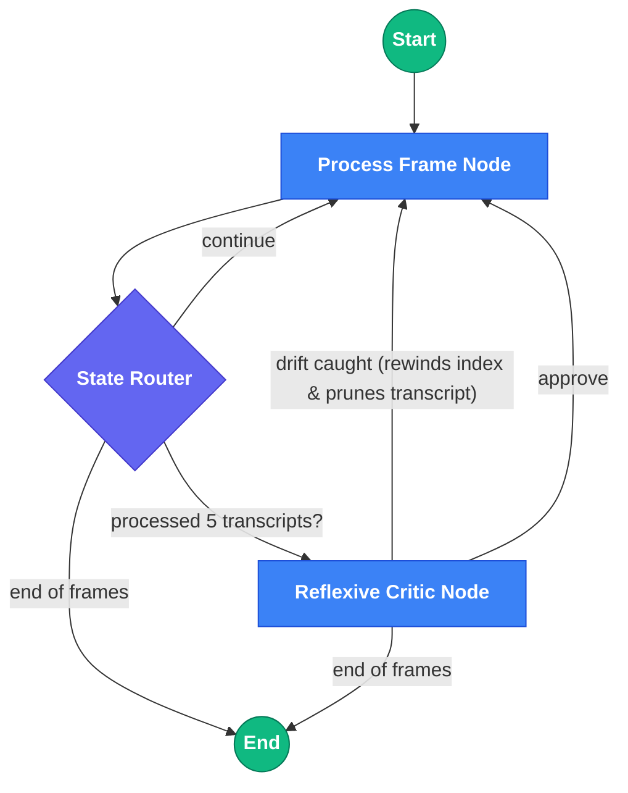

# 🎙️ unmuted

**Unmuted** is a local-first web application designed to turn your screen recording captures into polished, technical how-to videos fit for public consumption. It uses AI Vision-Language Models (VLMs) like OpenAI's GPT-4o, Anthropic Claude, or local Ollama instances to generate timestamped narration transcripts and text overlays by analyzing the visual UI and text in your recordings.

## ✨ Features

- **Automated Frame Extraction**: Uses `ffmpeg` to sample keyframes from your technical screen captures.
- **Tool & Technology Identification**: Automatically detects tools in use (Claude Code, Docker, Python, etc.) and enriches planning with web-researched context.
- **Strategic Planning with Synopsises**: Generates a high-level story plan and 3 narrative synopsises to guide frame-by-frame analysis.
- **Environment-Aware VLM Analysis**: Vision model understands which tools are active in each frame, correctly distinguishing user input in editors vs terminal commands.
- **High-Fidelity Text Recognition**: Uses high-detail image analysis for accurate OCR of code, commands, and UI text.
- **Agentic Auto-Finish**: Powered by a robust **LangGraph StateGraph**, the backend utilizes a Reflexive Critic agent to detect narrative drift and recursively correct mistakes during long sequences.
- **AI-Powered VLM Analysis**: Analyzes your action goals, story plan, and frame sequences to output polished transcripts and overlay suggestions.
- **Interactive Planning UI**: Review and edit the AI-generated story plan—delete unwanted tasks, add your own, before proceeding to frame analysis.
- **Stunning Review UI**: A modern Glassmorphism dashboard built with React allowing you to review and tweak transcripts in a Human-in-the-Loop workflow.

## 🧠 LangGraph Orchestration

Unmuted delegates the heavy lifting of processing continuous sequences to a formalized server-side LangGraph agent network.
This ensures strict 10-second contextual limits per extraction and implements an active Critic node that prevents the AI from wildly hallucinating when it gets confused.

The workflow is driven by four distinct AI Agent personas:
1. **The Tool Identifier**: Analyzes sample keyframes to detect all tools/technologies in use and researches unfamiliar tools via web search to enrich planning context.
2. **The Strategic Planner**: A precursor agent that performs a high-speed holistic scan of the entire video timeline to construct a one-sentence-per-phase "Story Plan" before any frame-by-frame processing begins. Uses identified tools to understand what's happening in each phase.
3. **The Synopsis Generator**: Creates 3 distinct narrative synopsises (one sentence each, no fluff) to guide the frame-by-frame analysis with different perspectives on the video's purpose.
4. **The Processor (Drafting Agent)**: The primary LangGraph node. It acts iteratively on single frames using a 3-frame sliding window, referencing the Story Plan, synopsises, tool context, and historical actions to draft candidate narrations. Understands which tool is active in each frame to correctly classify user input vs system output.
5. **The Reflexive Critic**: A secondary evaluating node in the LangGraph. It runs every 5 processing cycles (roughly every 50 seconds of video) to inspect the Processor's recent transcript backlog. If the drafted transcript severely deviates from the Story Plan, the Critic rewinds the StateGraph index, prunes the transcript, and forces the Processor to try again.



## 🛠️ Requirements

- `ffmpeg` (must be installed on your system and available in your PATH)
- Node.js (v18+) and `npm`
- Python 3.10+
- `uv` (Fast Python package/project manager)

## 🚀 Getting Started

The application is split into a Python FastAPI Backend and a React/Vite Frontend. You must run both concurrently.

### 1. Set up the Backend (API)

Open a terminal and navigate to the project directory:

```bash
cd backend

# Option A: Use OpenAI API
export VLM_PROVIDER="openai"
export VLM_MODEL="gpt-4o"
export OPENAI_API_KEY="sk-your-openai-key"

# Option B: Use external Ollama Server (e.g. gemma3)
export VLM_PROVIDER="ollama"
export VLM_MODEL="gemma3"
export OLLAMA_BASE_URL="http://192.168.88.86:11434/v1"
export OLLAMA_API_KEY="any-key" # Ollama accepts any string

# If no API key or provider is set, the engine will return "mock" data for UI testing!

### Enabling Verbose Debugging
If you feel the AI analysis is failing or just want to see the exact LLM payload and raw response for every single frame, export the debug flag *alongside* your API keys:
```bash
export DEBUG_VLM="true"
# Then start the server
uv run uvicorn main:app --reload
```
*The raw JSON from the model will print directly to your backend terminal.*

### 2. Set up the Frontend (UI)

Open a second terminal window:

```bash
cd frontend
# Install dependencies
npm install

# Start the Vite development server
npm run dev
```
*The UI will start on `http://localhost:5173`.*

### 3. Run with Docker (Recommended)

If you have Docker and Docker Compose installed, you can start the entire stack with a single command:

```bash
# Copy the example env file and add your API key
cp .env.example .env
# Edit .env with your VLM provider and API key, then:
docker-compose up --build
```

- The app will be available at `http://localhost:5173`.
- Your project workspaces will be persisted in `./backend/workspaces`.

### 4. Deploy to a Cloud Provider (e.g. Railway, Render, Fly.io)

The Docker Compose setup deploys anywhere that supports multi-container apps.

**Railway:**
1. Push your repo to GitHub.
2. Create a new Railway project → **Deploy from GitHub repo**.
3. Railway auto-detects `docker-compose.yml`. Set your env vars (`VLM_PROVIDER`, `VLM_MODEL`, `OPENAI_API_KEY`) in the Railway dashboard.
4. Expose the `frontend` service on a public port — Railway will give you a URL.

**Generic VPS (Ubuntu/Debian):**
```bash
# Install Docker
curl -fsSL https://get.docker.com | sh
# Clone the repo and deploy
git clone <your-repo-url> && cd unmuted
cp .env.example .env && nano .env   # add your API key
docker compose up -d --build
```

> [!NOTE]
> The frontend Nginx container reverse-proxies all `/api/*` requests to the backend, so only **one port (5173)** needs to be publicly exposed.

## 🎬 Usage Instructions

1. **Open the UI**: Navigate to `http://localhost:5173` in your browser.
2. **Setup Project**: Enter the absolute path to a folder containing `.mp4` or `.mkv` videos (e.g., `/home/user/unmuted`).
3. **Draft a Prompt**: Write a short prompt indicating the goal of the video (e.g., "Demonstrate how to deploy a Docker container to Kubernetes").
4. **Scan & Extract Frames**: 
   - Click **Scan Directory** to verify your videos are detected.
   - Click **Extract & Plan**. The backend will:
     - Extract keyframes via `ffmpeg`
     - Identify tools/technologies visible in the video (Claude Code, Docker, Python, etc.)
     - Generate a strategic story plan (one sentence per phase)
     - Generate 3 narrative synopsises to guide analysis
5. **Review & Edit Plan**:
   - Review the AI-generated story plan and synopsises.
   - Delete any unwanted tasks or edit existing ones.
   - Select your preferred synopsis (or the AI will use the first one).
   - Click **Begin Frame-by-Frame Review** to proceed.
6. **Interactive Review**: 
   - Step through the video frame-by-frame as the AI generates 3 distinct narration candidates.
   - The AI uses the story plan phase context, synopsis, tool information, and a sliding 3-frame window to understand what you're doing.
   - Select the best candidate (or write your own) and click **Commit & Next**.
   - At any time, click **Resume Auto-Finish** to complete the remaining frames using the AI's top choices.
7. **Synchronized Playback**: After completion, press play on the side-by-side video viewer to test your flow. The interactive timeline automatically highlights and syncs narration in real time.
8. **Export**: Click **Generate Export Artifacts**. Download your final transcript as `transcript.json`, `transcript.vtt` (WebVTT subtitle format), and YouTube Chapters list.

## 🔮 Roadmap / Next Milestones

- [ ] **Milestone 1**: Render Final MP4 with text overlays baked in via UI timeline data.
- [ ] **Milestone 2**: Synthesize text-to-speech audio streams (via local XTTS or external ElevenLabs) and embed the voiceover into the final MP4.
